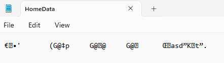

**Jordan Keating**

**May 31, 2023**

**Foundations of Programming: Python**

**Assignment 07**

**[GitHub Page](https://jskeating.github.io/IntroToProg-Python-Mod07/)**
# Pickling and Error Handling
## Introduction
This assignment was a bit more open-ended - our task was to create a program that demonstrates both pickling and error handling. I will start out by talking a little bit about the differences between pickled files and the text files we’ve been working with previously and then move into my idea for a program, a Home Buying/Selling calculator. The program will require quite a bit more time and attention later on to be really show ready for an interview situation, but it was a fun stretch to see what I could come up with while exhibiting these two techniques. 
## Text files vs. Binary files
So far in this course, we’ve been reading, writing and appending text files. Binary files work in much the same way, but with a couple of key differences. Binary files save data in bytes while a text file saves data as characters. A text file is easily manipulated from outside of a program (it’s easy to read and understand from the NotePad for example), while a binary file would be difficult to change outside of the intended program. 

By using pickling, as we’ll see later, you can add an additional level of security to the data you intend to store. When opened by a human, these binary files will look almost like complete gibberish. Only when the file is “un-pickled” can one understand what the data means. 

##### Figure 1.1 - A pickled text file

## The Home Buy/Sell Calculator
For my script, I decided to demonstrate pickling and error handling with a home-selling based program. I started by using pseudo-code to explain the goals of my program and help me start to outline how I’ll accomplish them. I’m going to first ask for user input on whether or not they’d like to buy or sell, then collect some information I would need to help them see their expected proceeds from selling the home (current mortgage, expected sale price, commissions they’ll pay to agents, etc). I’ll then need to display all of this back to them in an easy to understand block of info. I’m also going to create a custom exception class if the user selects “buy”. This will serve two purposes - it allows me to illustrate how to create a custom exception AND will save me some time on this assignment! :) 

#####  Figure 2.1 - Pseudo-code for Presentation aspects 

Our first step is to collect the first user input for their “Buy” or “Sell” choice. I’m going to create an IO (input/output) class with a buy_or_sell function inside of it. This function will collect the user choice and return it to the main body of our script. I’m asking for the user to provide either “B” for Buy or “S” for Sell. This opens us up to a couple of different potential user errors - they could enter a letter we aren’t expecting, they could enter a number, they could enter nothing! Let’s create some custom errors to catch these different options. 

To do this, I’m going to create a Processor function called choice_check - choice_check is going to take the choice we collected from the buy_or_sell input and run it through various checks to ensure we’re getting what we want (essentially just “S”). The best way to do this is with a try/except block. Before we work on our code, let’s back up and show some examples of a try/except block in action. 

## try/except Blocks
Let’s say you are expecting one type of input from a user, but they give you something completely different. Usually, that will end your script with an error message from Python. For example, see Figure 3.1 for a simple addition script. 

##### Figure 3.1 - A simple addition program adding two user inputs

Let’s say a user enters a script variable instead of a number - what happens then? Python will generate an error message and end the program. As you can see in Figure 3.2, the error messages are complicated and somewhat confusing - especially for a user not familiar with the inner workings of your script. 

##### Figure 3.2 - Python’s ValueError message displayed to the user

By using a try/except block, you can accomplish two things - send a more user-friendly error message and keep your program from ending. Let’s set up a try/except block within a while loop that will keep the program going as long as the user has not entered two integers to be added. 

##### Figure 3.3 - Seeing our try/except block in action

The program will first read the try section and attempt to run the script there. If an error is encountered, the program jumps to the except portion and runs the script there. As you can see in the output, the user entered an invalid option (a string variable where an integer was expected) and the except script was run (“Something went wrong!” was printed). Using the while loop gives the user another chance to enter the correct variables. 

That seems easy enough, but sometimes it may be unclear to you or your user what is actually causing the error. You can use Python’s internal programming to help you identify what the error is and help you add more specificity to your outputs to the user. Using the as command, you can capture the argument from the raised exception in your try block as a variable and use that to provide the end user more information. See Figure 3.4 for some helpful options. 

##### Figure 3.4 - Using the as keyword to obtain error message info 

By using the as keyword and obtaining the error class (ValueError) in this case, we can also set up an exception block specifically to catch that error. This allows us to be more specific in our corrections to the end user. See Figure 3.5 for an updated run. 

##### Figure 3.5 - Our error is caught as a ValueError and the user is prompted to use an integer

Finally, we can also create our own error catching exceptions and arguments for any custom-errors we’d like within our program. Let’s jump back into the main script and see how that works. 

## Creating a Custom-Error Block
Each error block is essentially its own class, so we’ll create them similarly to how we create our IO and Processing classes. You name the error and define the string to be returned when a user encounters this error. See Figure 4.1 and 4.2 for our first example. 

##### Figure 4.1 - buy_not_ready error returns message to the except block where the error was raised. 

##### Figure 4.2 - User enters “b” and triggers our custom buy_not_ready exception

We’ll also create another block in case the user enters anything else other than the “s” that we want. 

##### Figure 4.3 - User errors with input other than “s” or “b” and is reminded of available inputs

With the special errors dealt with, I’m going to skip ahead through some of my basic coding and move to the pickling section of the program. 

## Pickling your data
As we discussed above, pickling your data into a binary file can be extremely useful. While I have big dreams for my Home Buy/Sell program, for now I’ll simply settle with saving the data we acquired from the user into a binary file called HomeData.dat.  I collected information from the user through an IO function titled seller_inputs and used those to make some calculations about their potential proceeds from selling their home. I’m going to also save that data for potential future use. I’ll prompt the user to save and if yes, we’ll run our save_data_to_file processor function. To use the pickle functions, you must first use the import pickle command to load these functions for use - we’ll be using both pickle.load() and pickle.dump(). See Figures 5.1 through 5.3 to see them in action

##### Figure 5.1 - Main body of script

##### Figure 5.2 - save_data_to_file processor function

To ensure the data was saved as a binary file, I’ll run the program below and check our outputs. I’m also opening our binary file and reading it back (see read_data_from_file function in Figure 5.3) and then also opening the saved binary file as if it were a text file to see the “pickled” data within our program (see Figure 5.4). 

##### Figure 5.3 - Reading our binary file

##### Figure 5.4 - Reading our binary file as a text file

## Testing
Alright, we’ll now test all features in both PyCharm and CMD to ensure our script is working as intended. 

##### Figure 6.1 - Running in PyCharm - Catching both custom errors successfully and looping back into program 

##### Figure 6.2 - Running in PyCharm -  “Sell” option collects user data, calculates proceeds, and saves into pickled binary file which is then read back and displayed to user (both pickled and unpickled) before exiting the program

##### Figure 6.3 - HomeData.dat file updated successfully - “123 Main St” is visible from user inputs

##### Figure 6.4 - Running in CMD - Catching both custom errors successfully and looping back into program

##### Figure 6.5 - Running in CMD - “Sell” option collects user data, calculates proceeds, and saves into pickled binary file which is then read back and displayed to user (both pickled and unpickled) before exiting the program

##### Figure 6.6  - Confirming HomeData.dat changes - “1600 Washington Ave” visible 

## Building a Git-Hub website
As the last piece of this assignment, we’ll be re-building this doc into a GitHub website. This is an awesome skill to have in your toolbelt - these can be super handy for future job interviews, reference for other projects, or just showing off your work to friends and family. 

We start by creating a new repository for this Module (see Figure 7.1) and then creating a new index.md file which is where we’ll do our actual editing (see Figure 7.2). To create the new repository, log into your GitHub account and select the green “New” button on your Repositories tab. Remember to add a ReadMe.md file to the repository for any comments you’ll want to make for your viewers.

##### Figure 7.1 - Creating a new repository

To add the index.md page, click on the “Add New File” button on your repository page. At the top of the page,  you’ll see a file path prompting you to “Name your file…”. In this box, you’ll want to type “docs” followed by a forward slash and then “index.md”. This will create a “docs” folder and place your index.md file inside it. 

##### Figure 7.2 - Creating the index.md file

The index.md file is where we’ll work on recreating our document. Click on the pencil tool to begin editing and you’ll see you have two panes to view your file in - “Edit” and “Preview”. Edit allows you to use “markdown” language to format your text. Markdown has many different uses, but for our purposes in this assignment, I’m mostly going to be using the single and double asterisks (single for italics, double for bold), the hashes (single hash is large header, double hash is slightly smaller, and so on up to six hashes), and coding to insert photos. Much more info can be found in this GitHub article: Basic writing and formatting syntax - [GitHub Docs - Basic formatting syntax](https://docs.github.com/en/get-started/writing-on-github/getting-started-with-writing-and-formatting-on-github/basic-writing-and-formatting-syntax#section-links).

## Summary
In this assignment, we set off on our own adventure in creating a program. I decided to begin creating a real estate calculator that I can hopefully one day share with my clients (as a Real Estate agent). The calculator helped me to demonstrate error handling as it occurs in Python, how we can create custom error blocks, and how we can use try/except blocks to prevent these errors from stopping our program in its tracks. We also looked at how this data can be stored more efficiently and securely by importing the pickle class and utilizing the functions there to create and read binary files. 

